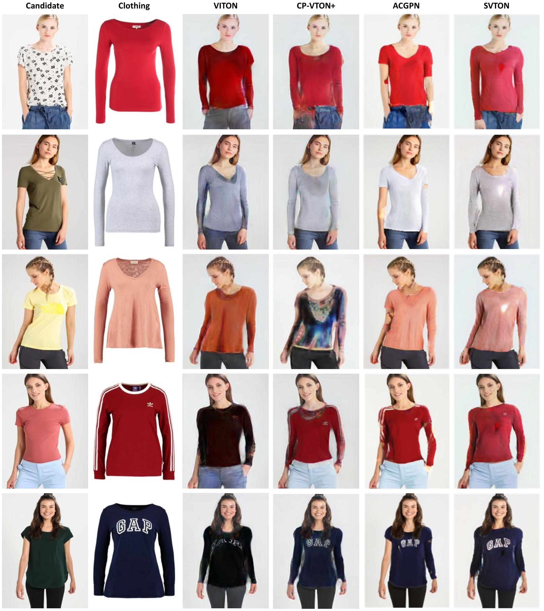

<div id="top"></div>

<h3> SVTON: SIMPLIFIED VIRTUAL TRY-ON</h3>

<p>
This repository has the official code for 'SVTON: SIMPLIFIED VIRTUAL TRY-ON'. 
We have included the pre-trained checkpoint, dataset and results.   
</p>

> **Abstract:** *We introduce a novel image-based virtual try-on model designed to replace a candidate's garment with a desired target item. The proposed model comprises three modules: segmentation, garment warping, and candidate-clothing fusion. Previous methods have shown limitations in cases involving significant differences between the original and target clothing, as well as substantial overlapping of body parts. Our model addresses these limitations by employing two key strategies. Firstly, it utilises a candidate representation based on an RGB skeleton image to enhance spatial relationships among body parts, resulting in robust segmentation and improved occlusion handling. Secondly, truncated U-Net is employed in both the segmentation and warping modules, enhancing segmentation performance and accelerating the try-on process. The warping module leverages an efficient affine transform for ease of training. Comparative evaluations against state-of-the-art models demonstrate the competitive performance of our proposed model across various scenarios, particularly excelling in handling occlusion cases and significant differences in clothing cases. This research presents a promising solution for image-based virtual try-on, advancing the field by overcoming key limitations and achieving superior performance.*

## Installation

Clone this repository:

```
git clone https://github.com/1702609/SVTON
cd ./SVTON/
```

Install PyTorch and other dependencies:

```
pip install torch==1.10.2+cu113 torchvision==0.11.3+cu113 torchaudio===0.10.2+cu113 -f https://download.pytorch.org/whl/cu113/torch_stable.html
pip install -r requirements.txt
```

## Dataset

Download the dataset by clicking on this link: 
[[Dataset]](https://www.dropbox.com/s/8nl54f3uzf5p6zi/SVTON_DATASET.zip?dl=0)
 Extract the files and place them in the ```viton_dataset``` directory

## Pre-trained Checkpoint

Download the checkpoint by clicking on this link: 
[[Pre-trained checkpoints]](https://www.dropbox.com/s/oz1ypn9aeeblagj/checkpoints.zip?dl=0) 
Extract the files and place them in the ```checkpoint``` directory

## Inference
To run the inference of our model, execute ```python run_inference.py```

To create your own custom pair of candidate image and target clothing, follow these steps:
- Create a text file within the viton_dataset directory.
- In the text file, add the name of the candidate image in the first column and the name of the garment in the second column.

```python run_inference.py --datapairs custom.txt```

## Train
To train, run ```python -m torch.distributed.launch --nproc_per_node=<number_of_gpus> train_[phpm/gmm/tom]``` and the checkpoint will be saved periodically in the ```checkpoint_[phpm/gmm/tom]``` directory.

<!-- Results -->
## Results
